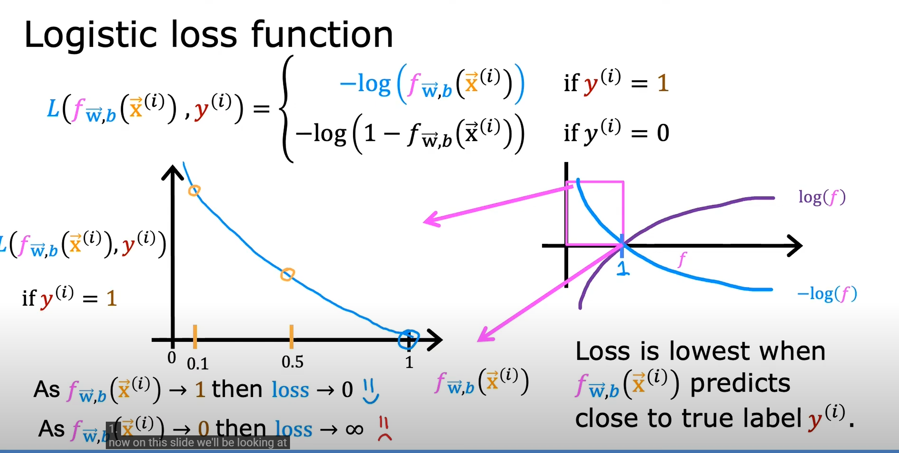
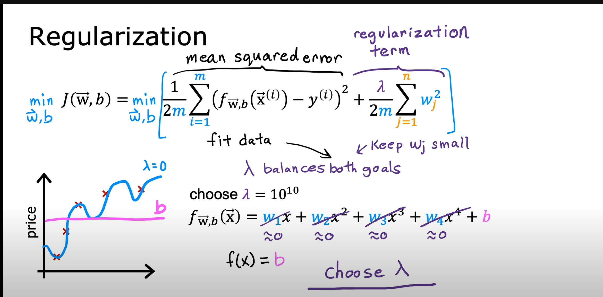
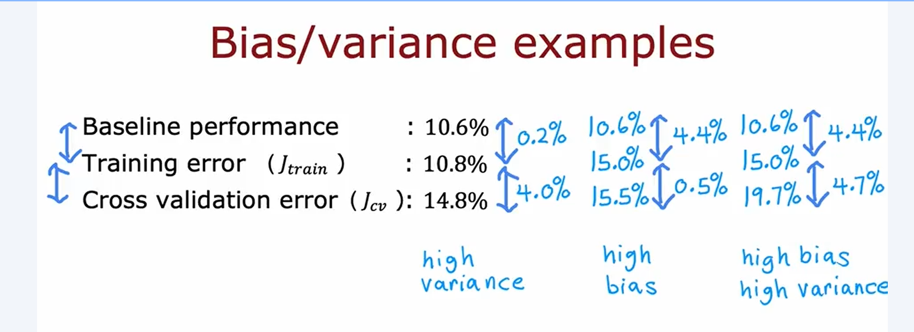
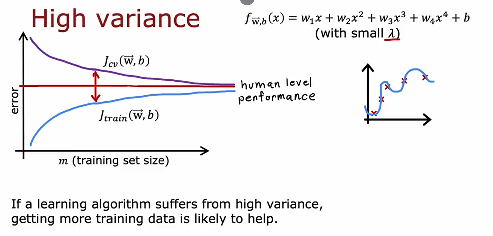
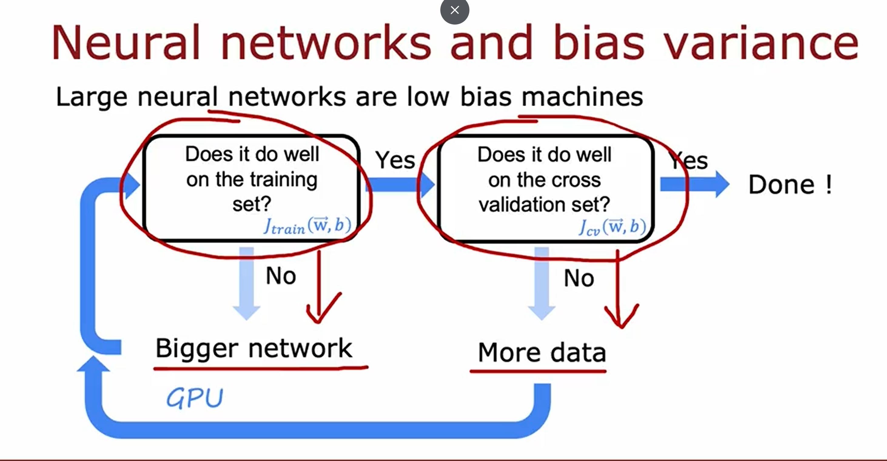

# Logistic Regression

Logistic regression is used for classification problems. It models the probability that a given input belongs to a particular class using the logistic (sigmoid) function.

(./lab/Logistic Regression_sigmoid.ipynb)

# Decision Boundary

A decision boundary separates different classes in the feature space. In logistic regression, the boundary is determined by the model's parameters and the sigmoid function.

(./lab/Decision Boundary for Logistic Regression.ipynb)
# Logistic Loss Function

The logistic loss function (also called log-loss or cross-entropy loss) measures the performance of a classification model whose output is a probability value between 0 and 1.

(./lab/Logistic Regression and Logistic loss.ipynb)

# Simplified Loss Function

A simplified loss function can be used for binary classification, making calculations and optimization more efficient.

(./lab/Cost Function for Logistic Regression.ipynb)
# Gradient Descent for Logistic Regression

Gradient descent is also used to optimize the parameters in logistic regression by minimizing the logistic loss function.

(./lab/Gradient descent for Logistic Regression.ipynb)

## Logistic Function with Scikit-Learn

Scikit-Learn provides a simple and efficient implementation of logistic regression. Here's how to use it:
(./lab/Logistic by Scikit-Learn.ipynb)
# Addressing Overfitting

Overfitting occurs when a model learns the noise in the training data rather than the actual pattern. To address overfitting:
1. Collect more data
2. Select relevant features
3. Reduce the size of parameters (regularization)
(./lab/Overfitting.ipynb)
# Regularized Linear Regression

Regularization adds a penalty to the loss function to discourage complex models and reduce overfitting. Common techniques include L1 (Lasso) and L2 (Ridge) regularization.

(./lab/Regularized Cost and Gradient.ipynb)

## High Variance and High Bias
High variance (overfitting)

## Lab
(./lab/Logistic_Regression.ipynb)
## Regularized neuron network
