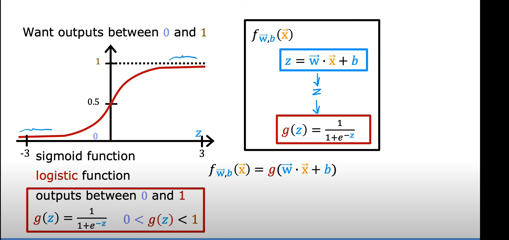
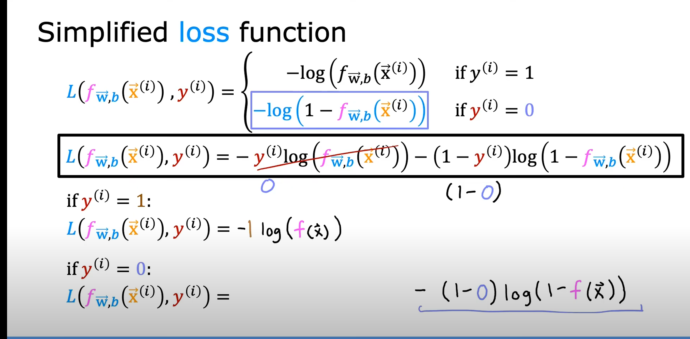
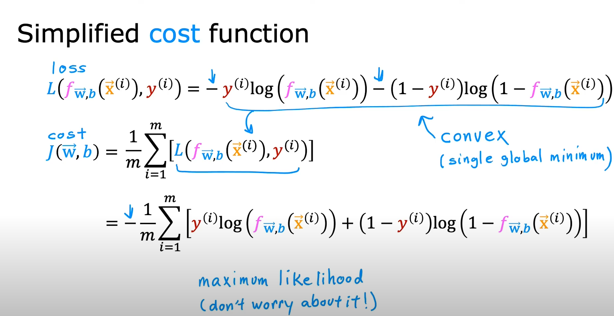
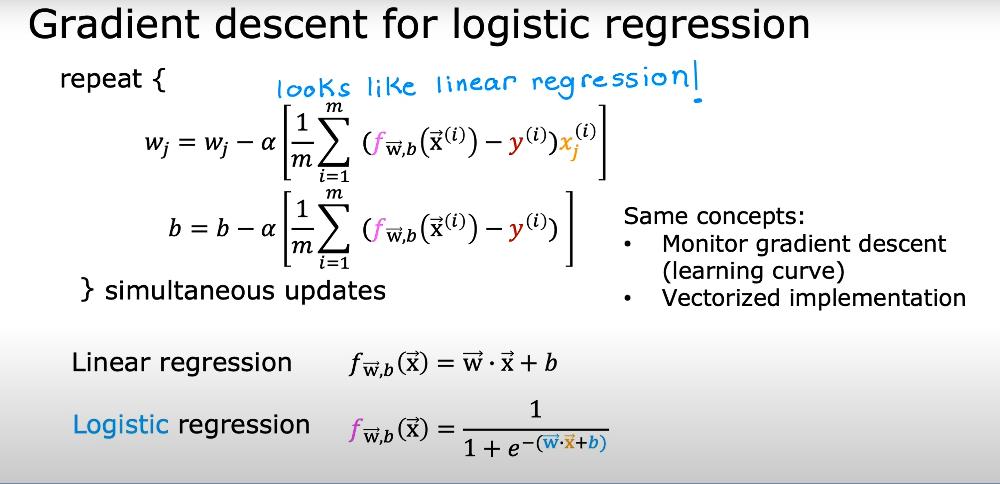
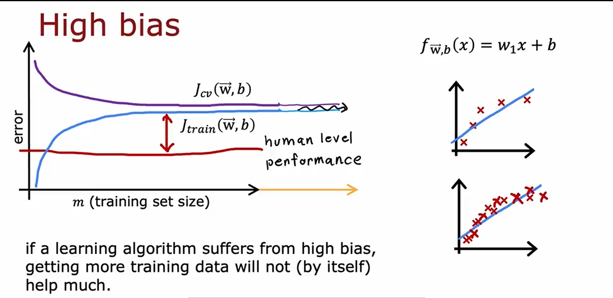
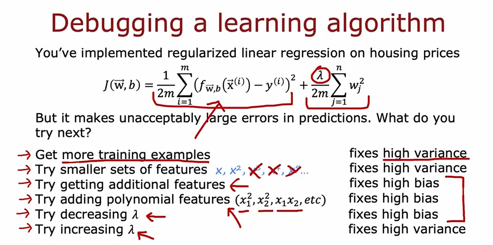
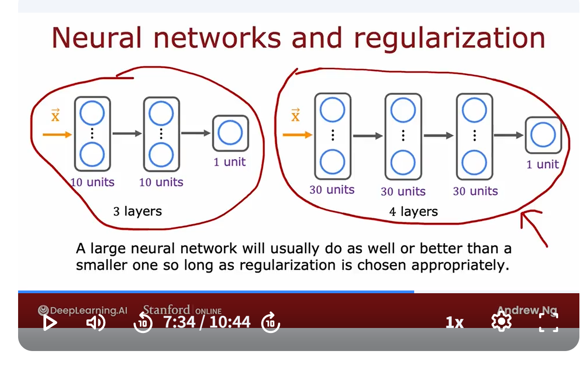

# Logistic Regression

Logistic regression is used for classification problems. It models the probability that a given input belongs to a particular class using the logistic (sigmoid) function.



[📓 Logistic Regression Sigmoid Lab](./lab/Logistic%20Regression_sigmoid.ipynb)

# Decision Boundary

A decision boundary separates different classes in the feature space. In logistic regression, the boundary is determined by the model's parameters and the sigmoid function.


[📓 Decision Boundary for Logistic Regression Lab](./lab/Decision%20Boundary%20for%20Logistic%20Regression.ipynb)
# Logistic Loss Function

The logistic loss function (also called log-loss or cross-entropy loss) measures the performance of a classification model whose output is a probability value between 0 and 1.


[📓 Logistic Regression and Logistic Loss Lab](./lab/Logistic%20Regression%20and%20Logistic%20loss.ipynb)

# Simplified Loss Function

A simplified loss function can be used for binary classification, making calculations and optimization more efficient.




[📓 Cost Function for Logistic Regression Lab](./lab/Cost%20Function%20for%20Logistic%20Regression.ipynb)
# Gradient Descent for Logistic Regression

Gradient descent is also used to optimize the parameters in logistic regression by minimizing the logistic loss function.



[📓 Gradient Descent for Logistic Regression Lab](./lab/Gradient%20descent%20for%20Logistic%20Regression.ipynb)


## Logistic Function with Scikit-Learn

Scikit-Learn provides a simple and efficient implementation of logistic regression. Here's how to use it:

[📓 Logistic Regression with Scikit-Learn Lab](./lab/Logistic%20by%20Scikit-Learn.ipynb)
# Addressing Overfitting

Overfitting occurs when a model learns the noise in the training data rather than the actual pattern. To address overfitting:
1. Collect more data
2. Select relevant features
3. Reduce the size of parameters (regularization)

[📓 Overfitting Lab](./lab/Overfitting.ipynb)
# Regularized Linear Regression

Regularization adds a penalty to the loss function to discourage complex models and reduce overfitting. Common techniques include L1 (Lasso) and L2 (Ridge) regularization.


[📓 Regularized Cost and Gradient Lab](./lab/Regularized%20Cost%20and%20Gradient.ipynb)


## High Variance and High Bias
High variance (overfitting)







## Lab

[📓 Logistic Regression Main Lab](./lab/Logistic_Regression.ipynb)
## Regularized neuron network


## One-hot Encoding
One-hot encoding is a technique used to convert categorical variables into a binary matrix representation. Each category is represented by a binary vector where only one element is "1" (indicating the presence of that category) and all other elements are "0".
## DictVertorizer
The DictVectorizer is a feature extraction tool in machine learning that converts a list of dictionaries into a matrix of features. Each dictionary represents a data point, and the keys in the dictionaries correspond to feature names. The DictVectorizer creates a sparse matrix where each column corresponds to a unique feature, and each row corresponds to a data point. It is particularly useful for handling categorical data and text data
Example
```python
from sklearn.feature_extraction import DictVectorizer
dv = DictVectorizer(sparse=False)

train_dict = df_train[categorical_features + numerical_features].to_dict(orient='records')
X_train = dv.fit_transform(train_dict) # Here the DV fit and transform in the same function

val_dict = df_val[categorical_features + numerical_features].to_dict(orient='records')
X_val = dv.transform(val_dict)
```