## Example
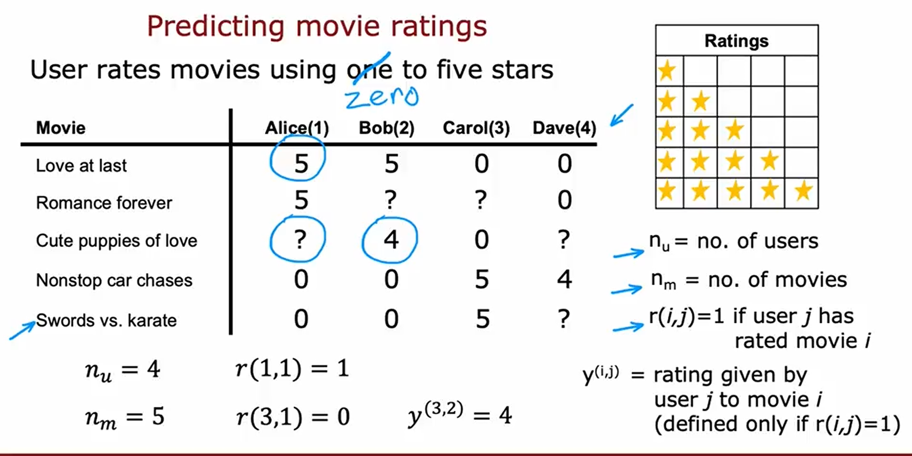

## Collaborative filter 

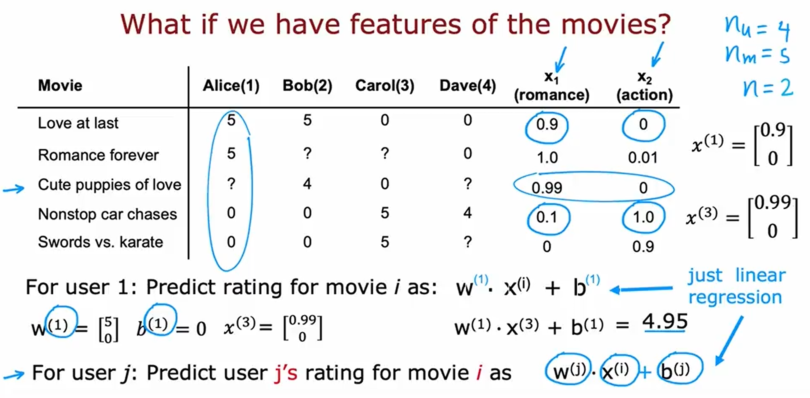
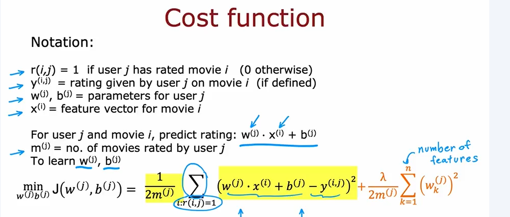
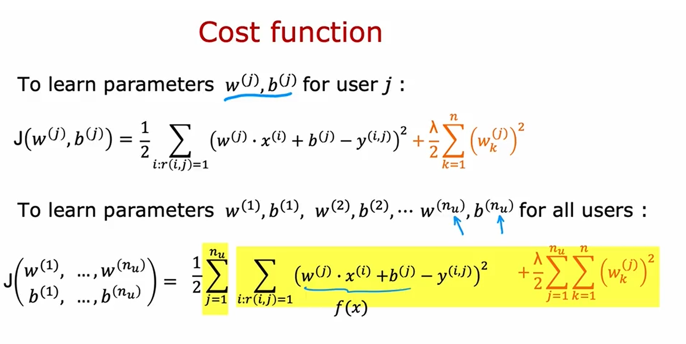
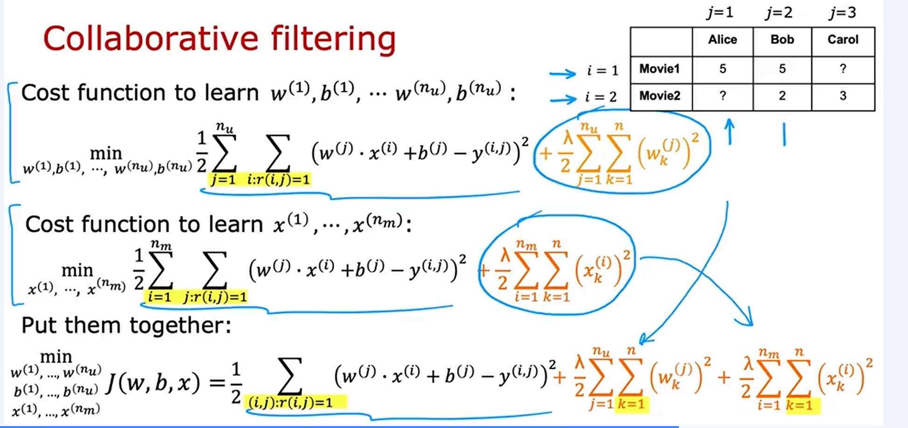
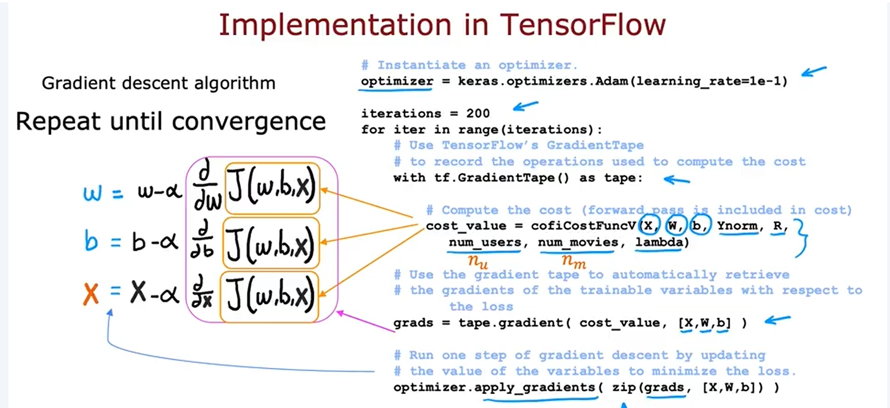
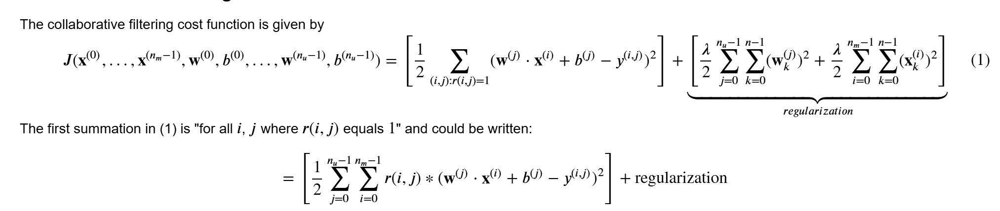
## Gradient descent
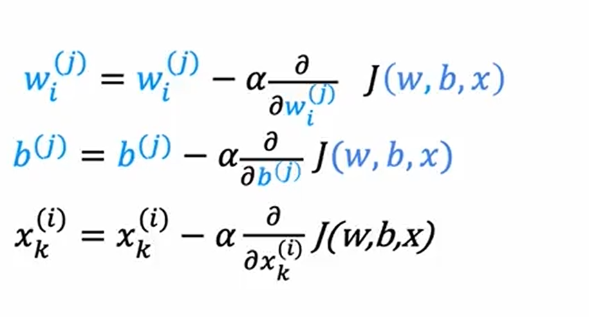

## Binary label
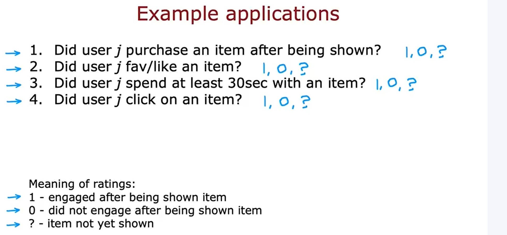
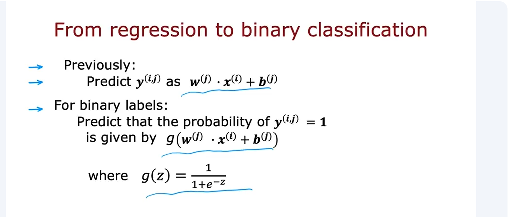
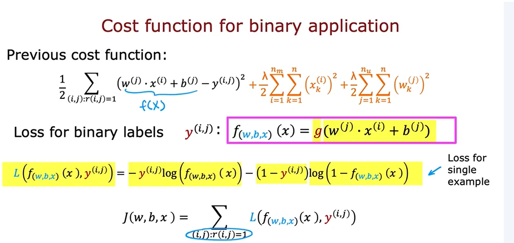

## Mean normalization
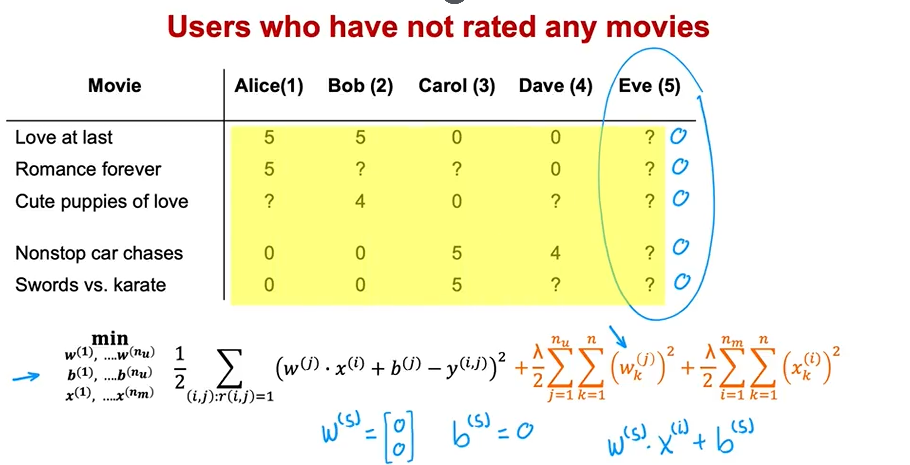
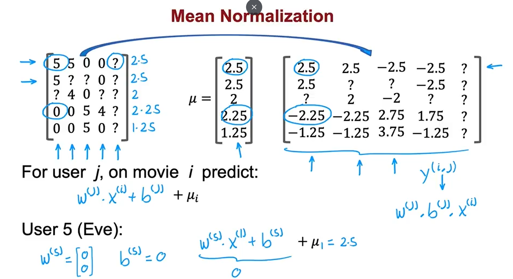
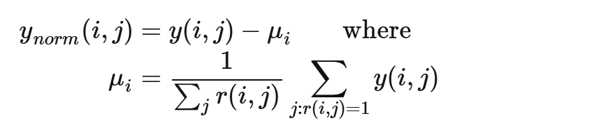

## Finding related item
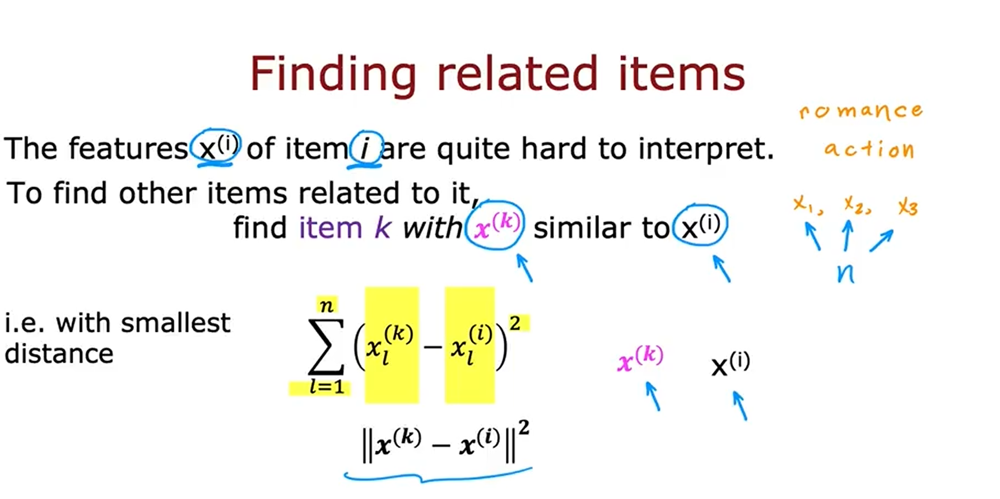

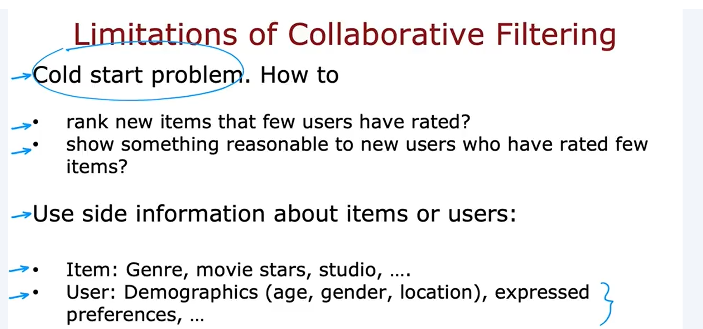

## Content-based filtering
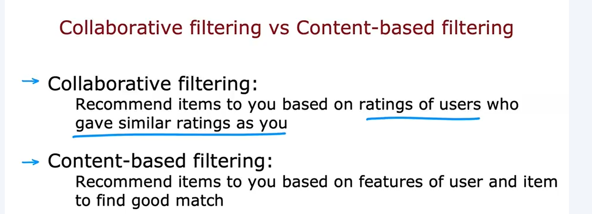

## Lab

[📓 Collaborative Filtering Lab](./Collaborative.ipynb)