## Example

## Application

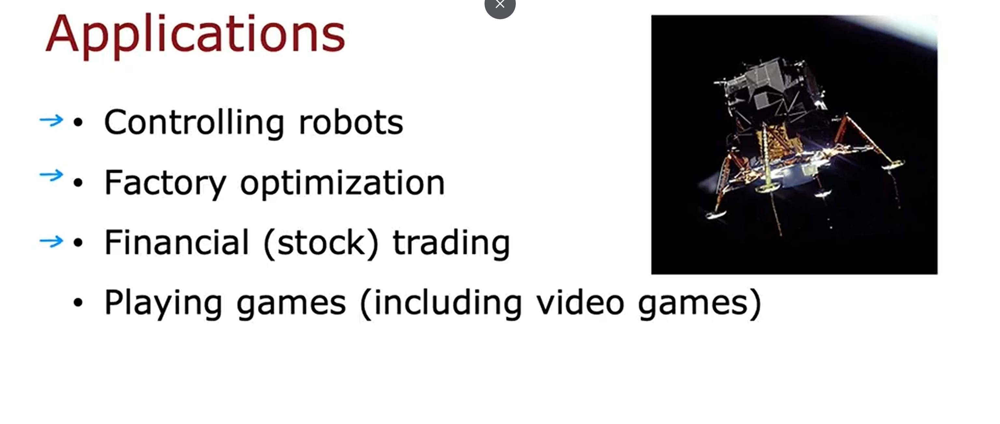

## The Return in reinforcement learning
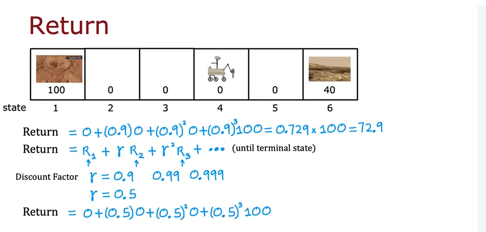

## Key concepts

## State-action value function
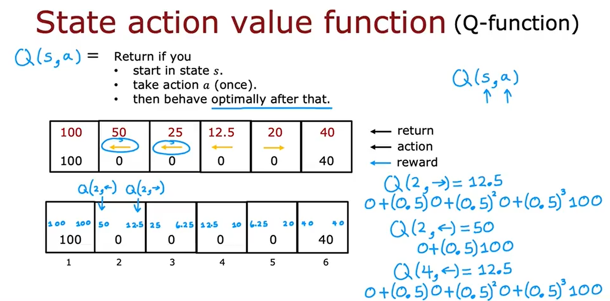

[📓 State-action Value Function Example Lab](./State-action%20value%20function%20example.ipynb)
## Bellman equation
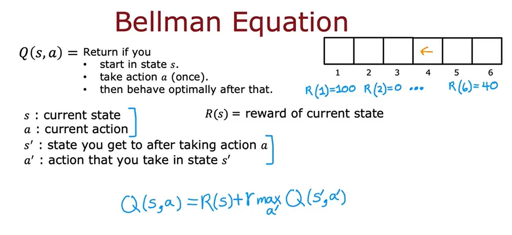
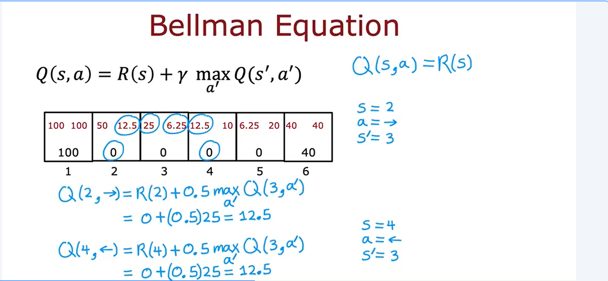

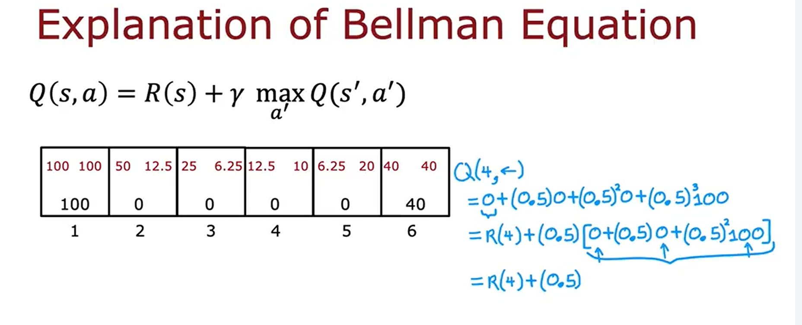

## Discrete vs Continuous

## Deep Reinforcement Learning
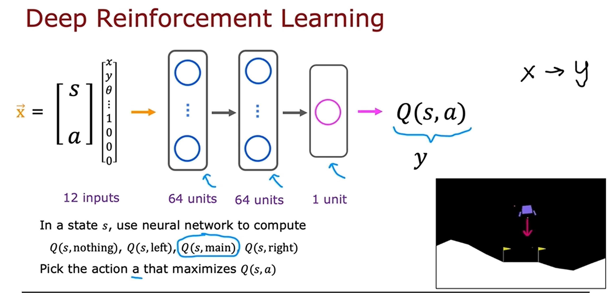
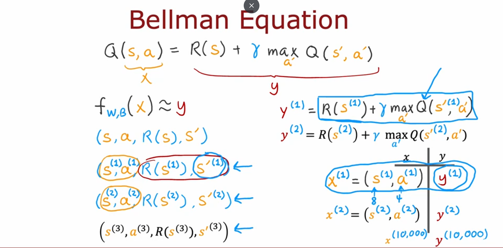

Improve neural network architecture:
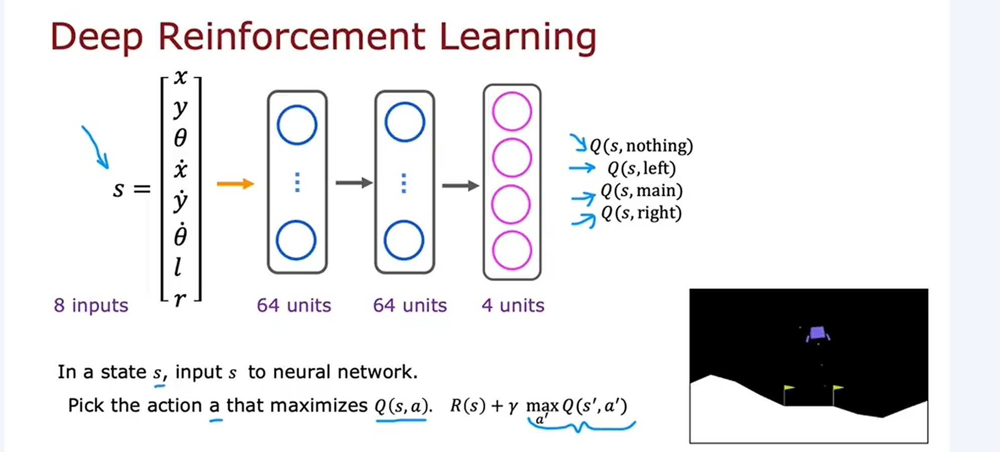

## Epsilon Greedy
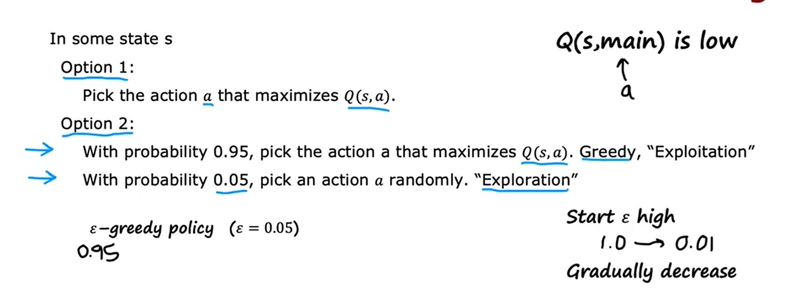

## Soft update
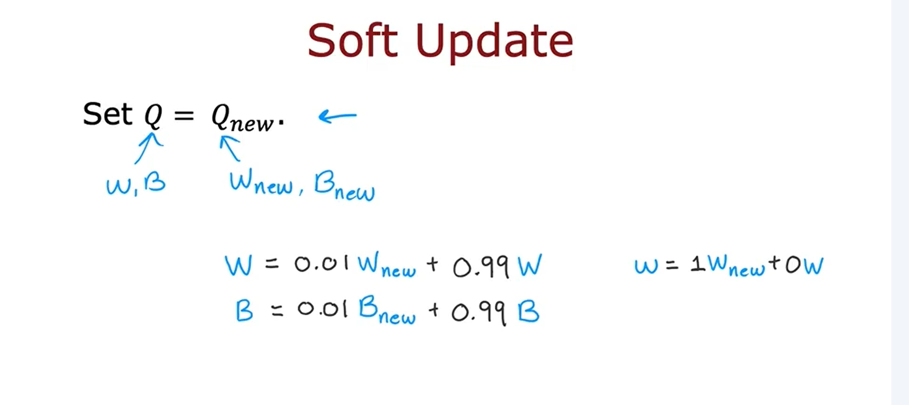

## Lab

[📓 Q-learning Lab](./Q-learning.ipynb)