# Chapter 7: Introduction to LLM

## LLM
The core language model for text generation and question answering.

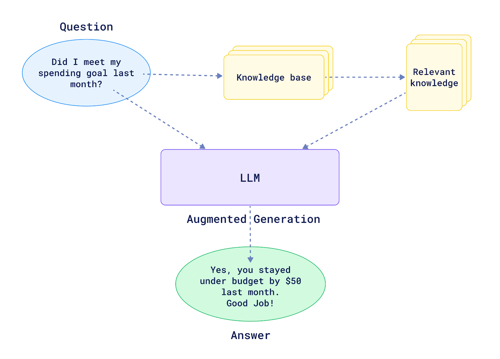

## RAG
RAG (Retrieval-Augmented Generation): Enhances LLM responses by retrieving relevant documents from a knowledge base.

## Vector Search
Vector search introduces new capabilities beyond traditional keyword-based search. Instead of matching keywords, it works on the semantics level (meaning). This allows it to:

- Match queries with different data modalities like images, videos, or sounds
- Match two different ideas expressed with different words but sharing the same meaning (e.g., "bat" and "flying mouse")

In vector search, texts, images, or other data are transformed into vectorized representations (embeddings), and their similarity is measured numerically using similarity metrics like cosine similarity.

### Why Qdrant?
Qdrant is an open-source vector search engine written in Rust, designed to make vector search scalable, fast, and production-ready for solutions involving millions or billions of vectors. Dedicated vector search solutions like Qdrant are needed for:

- Scalability of vector search
- Staying in sync with the latest trends and research in vector search
- Utilizing full vector search capabilities beyond simple semantic similarity

### Setting up Qdrant
Qdrant is flexible and can be run in various ways, including on your own infrastructure, Kubernetes, or in a managed cloud. For local setup, you can use a Docker container.

After pulling the Qdrant Docker image, you can run the container, mounting local storage to ensure data persistence.
Running Qdrant in Docker provides immediate access to its Web UI, which is beneficial for visually studying data and semantic similarity.

### Required Libraries
To work with Qdrant in Python, you typically install two main libraries in your virtual environment:

- **qdrant-client**: The official Python client for connecting to Qdrant. Official clients are also available for other languages
- **fastembed**: Qdrant's own library specifically for vectorizing data. It simplifies the process of turning data into vectors and uploading them to Qdrant. FastEmbed uses ONNX runtime, making it lightweight and CPU-friendly, often faster than PyTorch Sentence Transformers, and supports local inference

```bash
docker pull qdrant/qdrant

docker run -p 6333:6333 -p 6334:6334 \
   -v "$(pwd)/qdrant_storage:/qdrant/storage:z" \
   qdrant/qdrant
```

## Elasticsearch Setup

You can run Elasticsearch using Docker with the following command:

```bash
docker run -it \
    --rm \
    --name elasticsearch \
    -m 4GB \
    -p 9200:9200 \
    -p 9300:9300 \
    -e "discovery.type=single-node" \
    -e "xpack.security.enabled=false" \
    docker.elastic.co/elasticsearch/elasticsearch:9.0.0
```

## Vector Embeddings

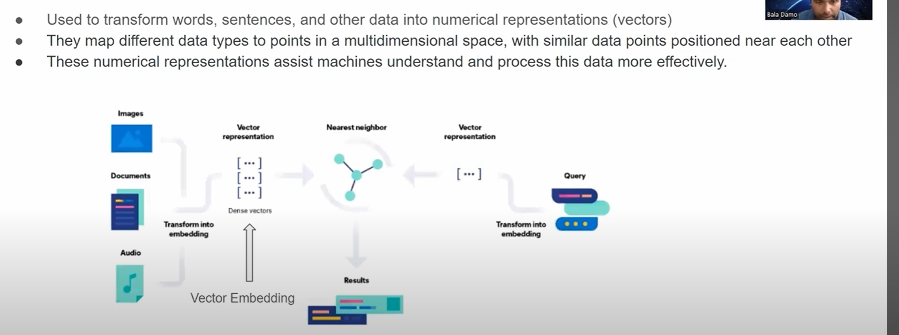
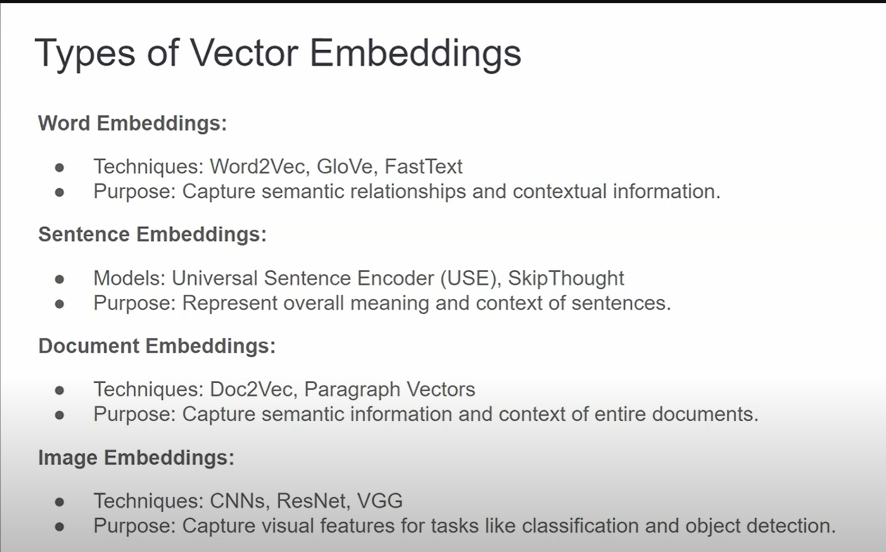  
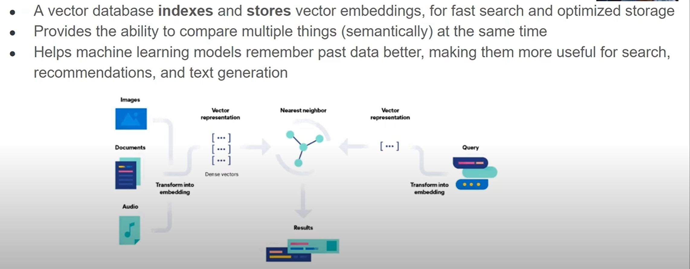


## **Offline Evaluation**
1. Offline LLM Evaluation: Cosine Similarity
Offline evaluation calculates metrics before deployment.
- **AQA Cosine Similarity**: Measures semantic closeness between LLM-generated and original answers.
  - Steps:
    1. Start with an original answer.
    2. Generate a question from it (LLM).
    3. Use RAG to get an LLM-generated answer.
    4. Compute cosine similarity between original and generated answers.
  - **Interpretation**: Ranges from -1 to 1. Higher is better.
  - **Model Comparison**:
    - GPT-4o: Good performance, but costly and slower.
    - GPT-3.5 Turbo: Cheaper, faster, similar scores (2% lower mean/median).
    - GPT-4o Mini: Even cheaper/faster, nearly identical performance to GPT-4o.
2. Offline RAG Evaluation: LLM Judges
LLMs can act as judges to evaluate RAG outputs.
- **Concept**: LLM is prompted to assess answer quality.
- **Prompt Cases**:
  1. With Original Answer: Judge compares generated answer to original (offline).
  2. Without Original Answer: Judge assesses answer relevance to question (online/offline).
- **Benefits**: Scalable, explainable, helps debugging.
- **Challenges**: Prompt engineering, bias, manual cleaning may be needed.

## Improving RAG
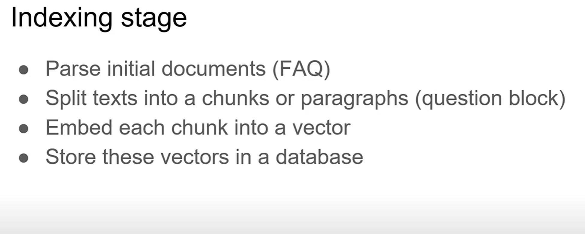
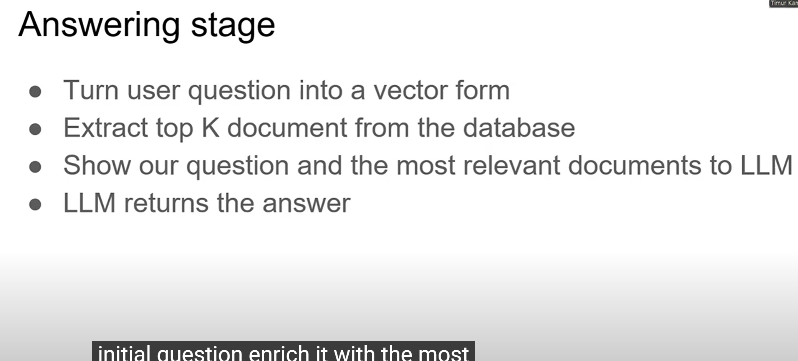
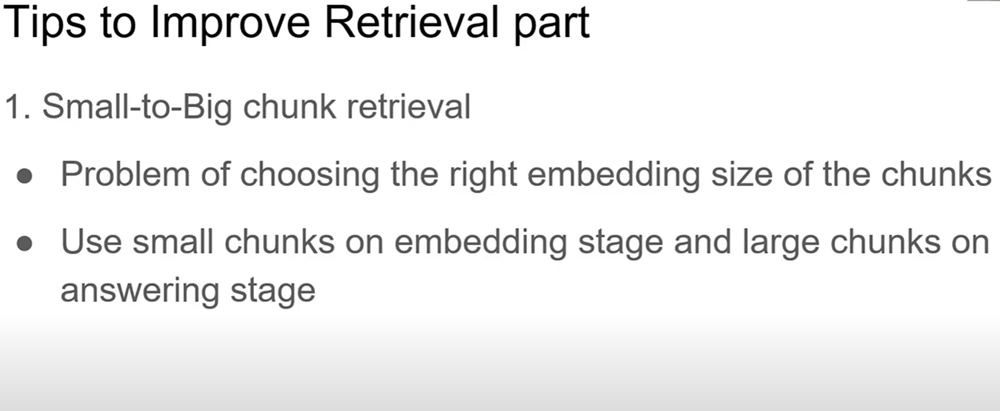
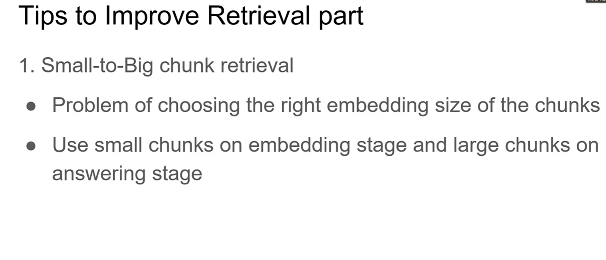
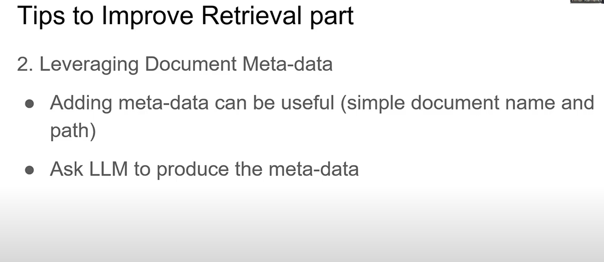
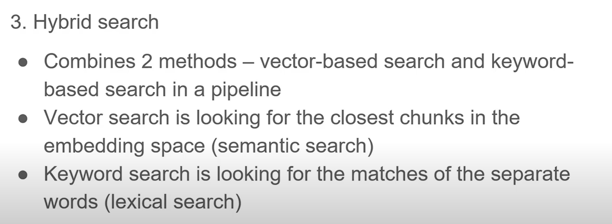
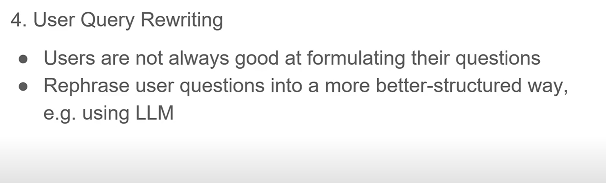
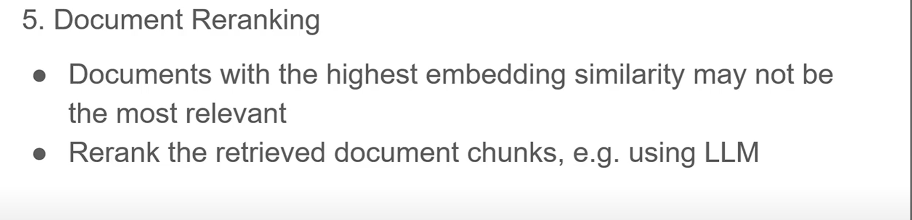

## Hybrid Search
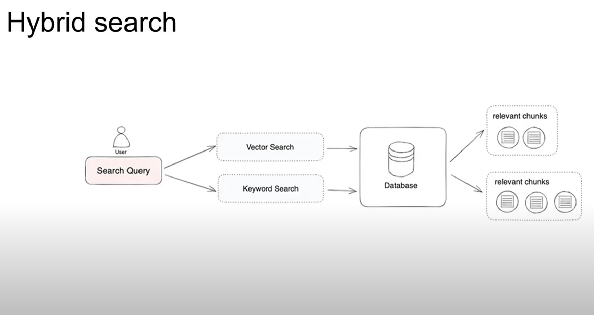

## Document Reranking
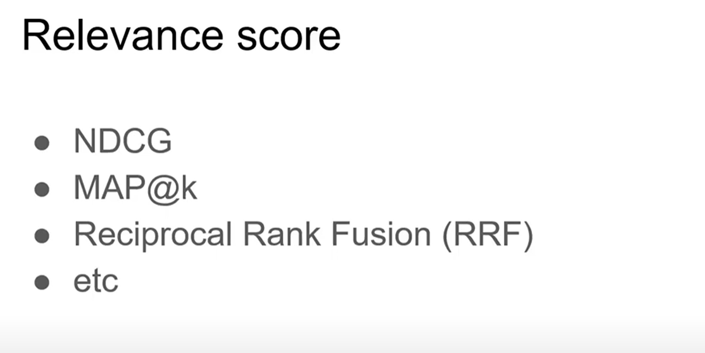