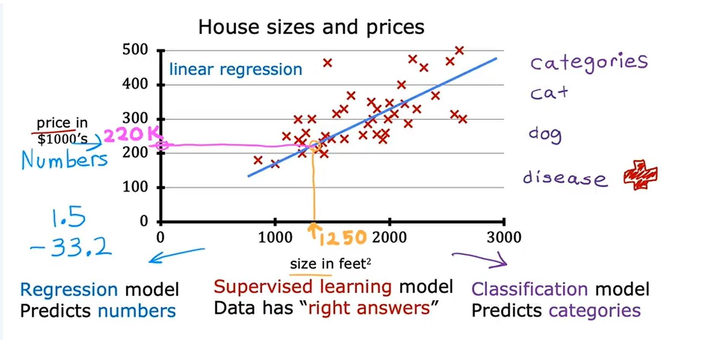
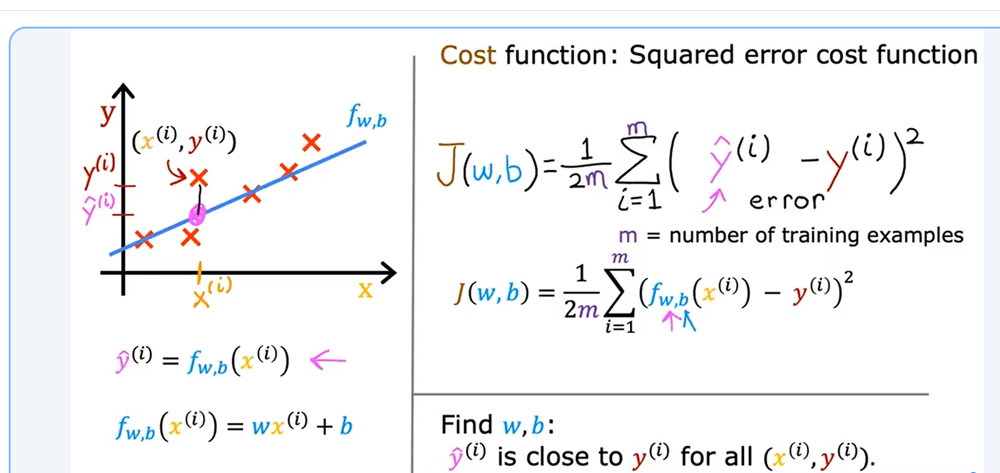
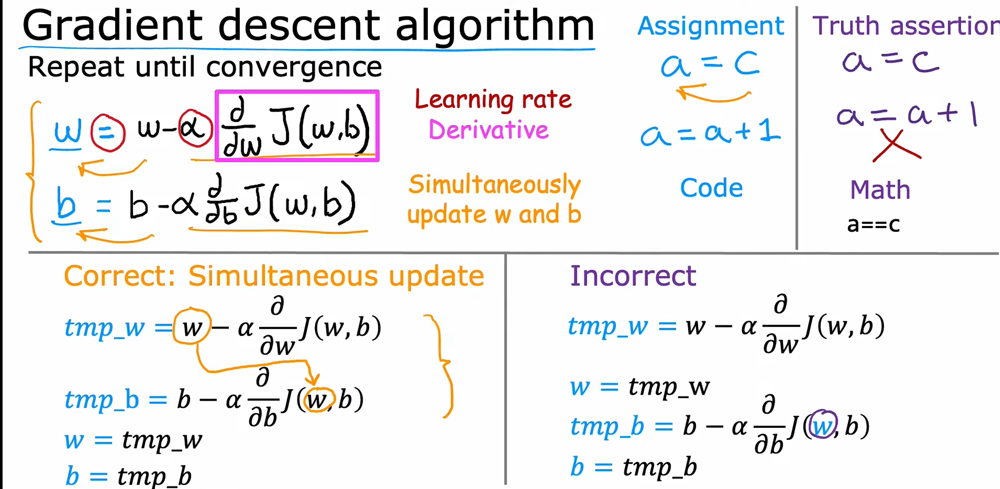
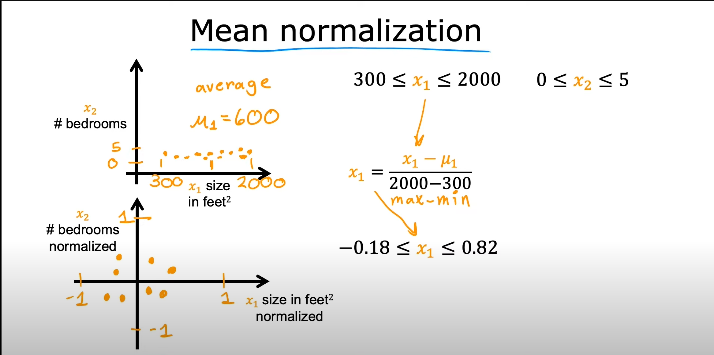
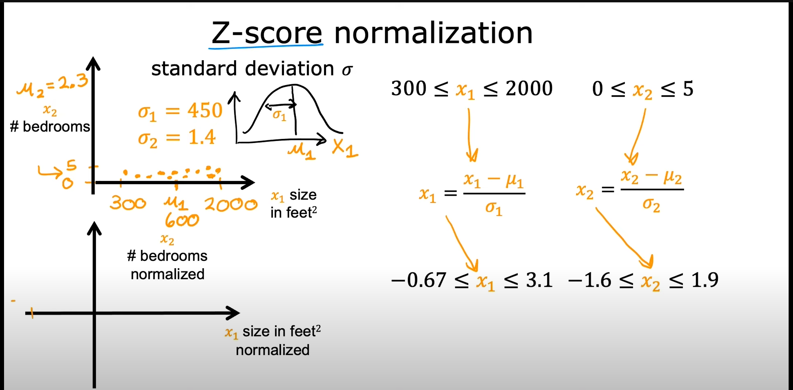
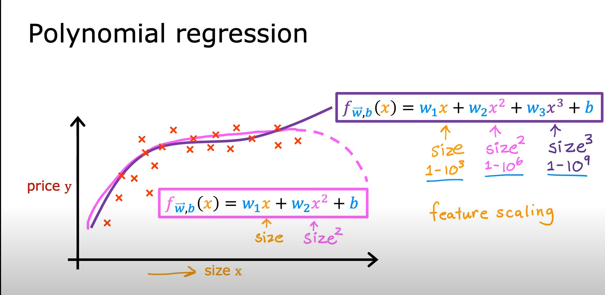

# Context

This chapter covers key concepts in machine learning optimization, including gradient descent, feature scaling, polynomial and logistic regression, loss functions, and regularization. Visual aids are provided to help illustrate each concept.

## Linear Regression

Linear regression is a fundamental machine learning algorithm used for predicting a continuous target variable based on one or more input features. The model assumes a linear relationship between the input features and the target variable.

(./lab/Model_Representation.ipynb)
## Cost Function

(./lab/Cost_Function.ipynb)

# Gradient Descent

Gradient descent is an optimization algorithm used to minimize a function by iteratively moving towards the steepest descent, as defined by the negative of the gradient. In machine learning, it is commonly used to find the parameters (weights) that minimize the loss function.

(./lab/Gradient_Descent_Linear_Regression)

# Feature Scaling

Feature scaling is a technique to standardize the range of independent variables or features of data. It helps gradient descent converge faster and improves model performance.

1. **Mean normalization**: Subtract the mean and divide by the range.
2. **Z-score normalization**: Subtract the mean and divide by the standard deviation.

(./lab/Feature_scaling_Learning_Rate.ipynb)
# Polynomial Regression

Polynomial regression extends linear regression by considering polynomial terms of the features, allowing the model to fit more complex, non-linear relationships.

(./lab/Feature Engineering and Polynomial Regression.ipynb)

## Linear Regression with Scikit-Learn
(./lab/Linear Regression by Scikit-Learn.ipynb)

## Lab
(./lab/Linear Regression lab.ipynb)

