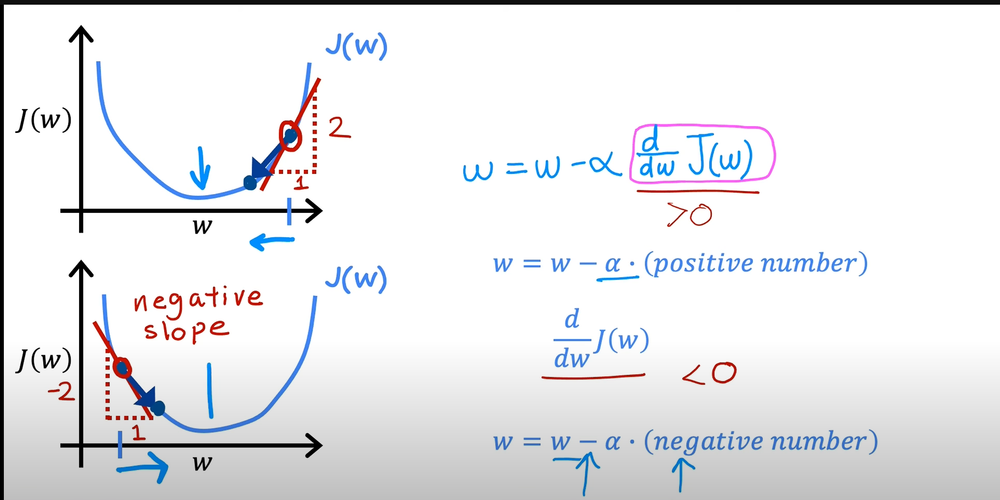
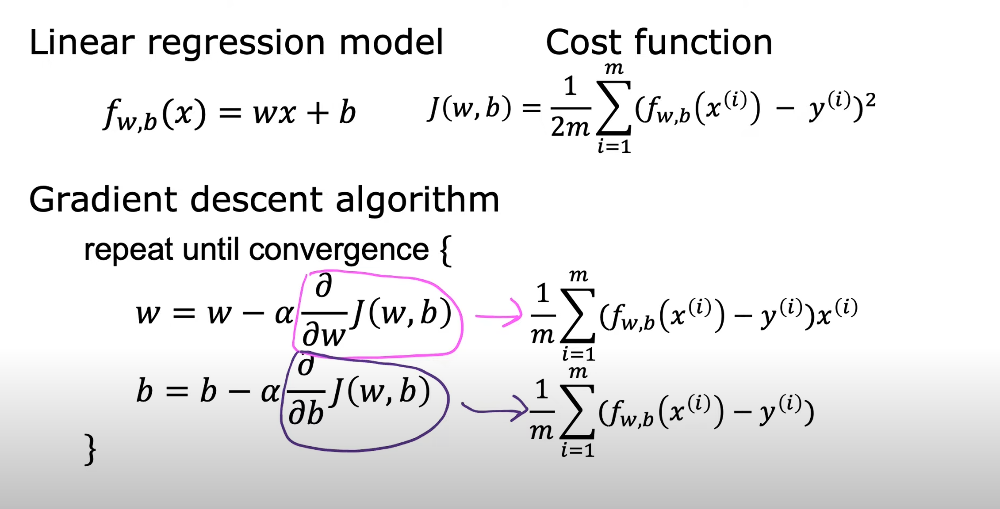
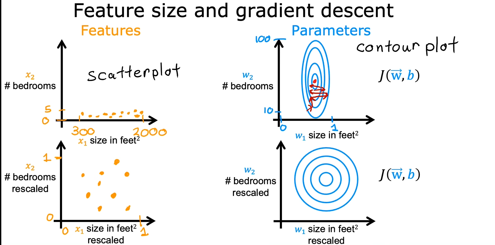
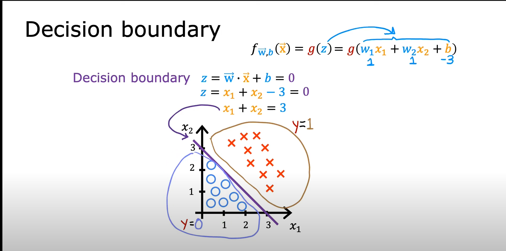
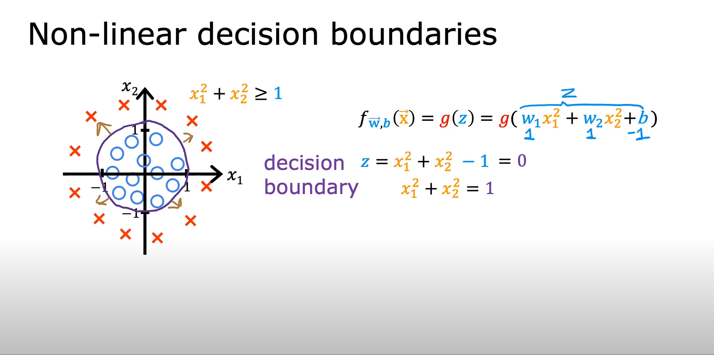
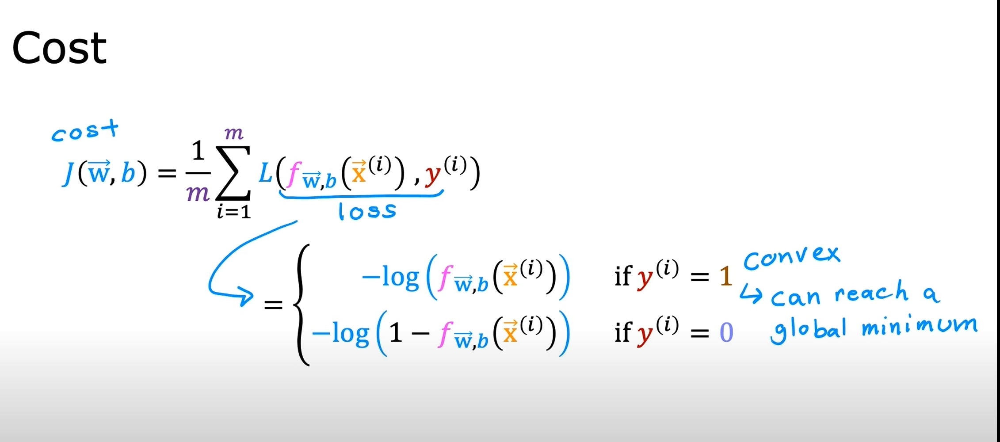
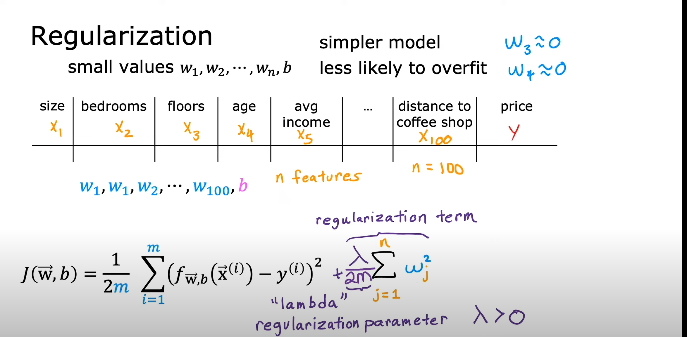

# Context

This chapter covers key concepts in machine learning optimization, including gradient descent, feature scaling, polynomial and logistic regression, loss functions, and regularization. Visual aids are provided to help illustrate each concept.

# Gradient Descent

Gradient descent is an optimization algorithm used to minimize a function by iteratively moving towards the steepest descent, as defined by the negative of the gradient. In machine learning, it is commonly used to find the parameters (weights) that minimize the loss function.

# Feature Scaling

Feature scaling is a technique to standardize the range of independent variables or features of data. It helps gradient descent converge faster and improves model performance.

1. **Mean normalization**: Subtract the mean and divide by the range.
2. **Z-score normalization**: Subtract the mean and divide by the standard deviation.

# Polynomial Regression

Polynomial regression extends linear regression by considering polynomial terms of the features, allowing the model to fit more complex, non-linear relationships.

# Logistic Regression

Logistic regression is used for classification problems. It models the probability that a given input belongs to a particular class using the logistic (sigmoid) function.

# Decision Boundary

A decision boundary separates different classes in the feature space. In logistic regression, the boundary is determined by the model's parameters and the sigmoid function.

# Logistic Loss Function

The logistic loss function (also called log-loss or cross-entropy loss) measures the performance of a classification model whose output is a probability value between 0 and 1.

# Simplified Loss Function

A simplified loss function can be used for binary classification, making calculations and optimization more efficient.

# Gradient Descent for Logistic Regression

Gradient descent is also used to optimize the parameters in logistic regression by minimizing the logistic loss function.

# Addressing Overfitting

Overfitting occurs when a model learns the noise in the training data rather than the actual pattern. To address overfitting:
1. Collect more data
2. Select relevant features
3. Reduce the size of parameters (regularization)

# Regularized Linear Regression

Regularization adds a penalty to the loss function to discourage complex models and reduce overfitting. Common techniques include L1 (Lasso) and L2 (Ridge) regularization.

