# Chapter 3: Neural Networks and Deep Learning

This chapter introduces neural networks, softmax activation, optimization algorithms, and convolutional neural networks (CNNs). Visual aids are included to help illustrate each concept.

## Neural Network
A neural network is a computational model inspired by the human brain, consisting of interconnected layers of nodes (neurons). Each neuron processes input data and passes the result to the next layer. Neural networks are used for tasks such as classification, regression, and pattern recognition.

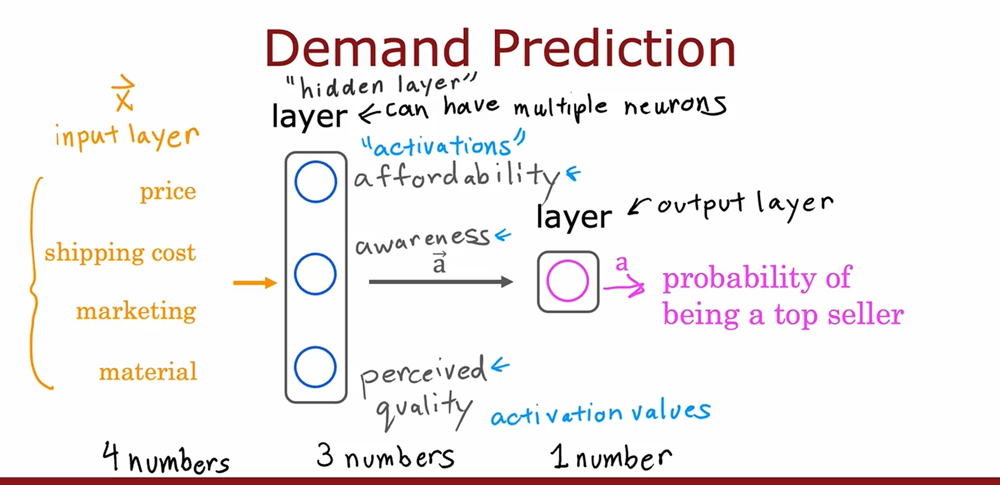

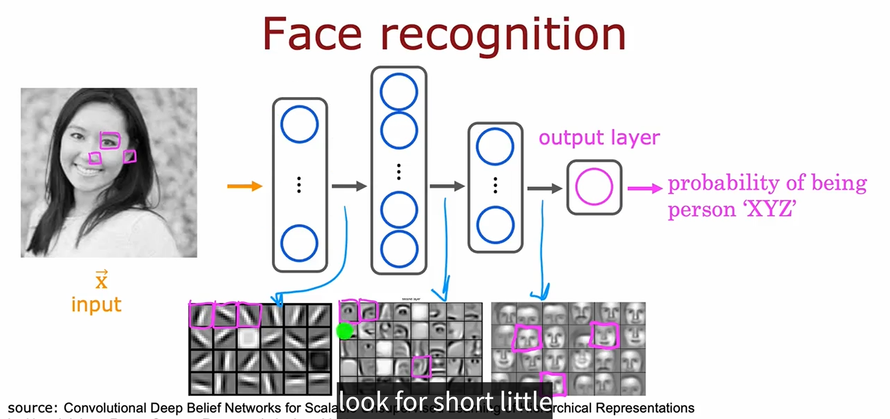

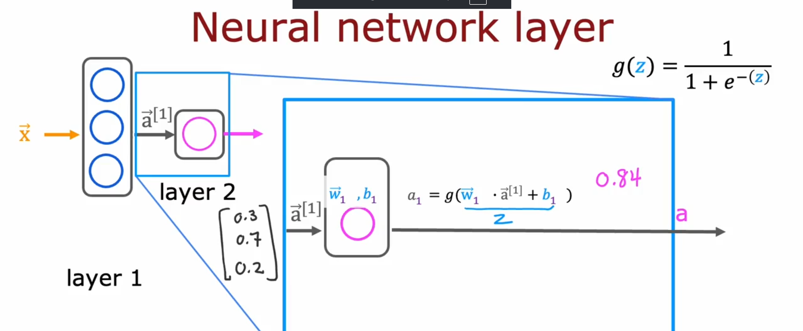
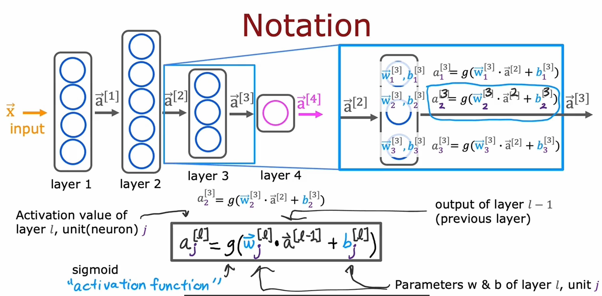
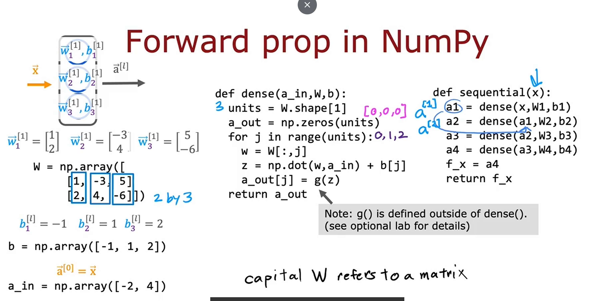
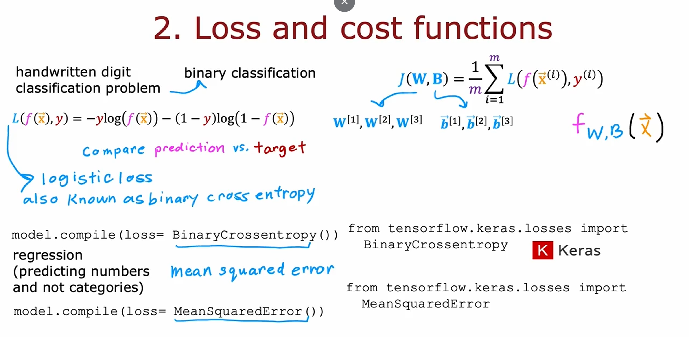

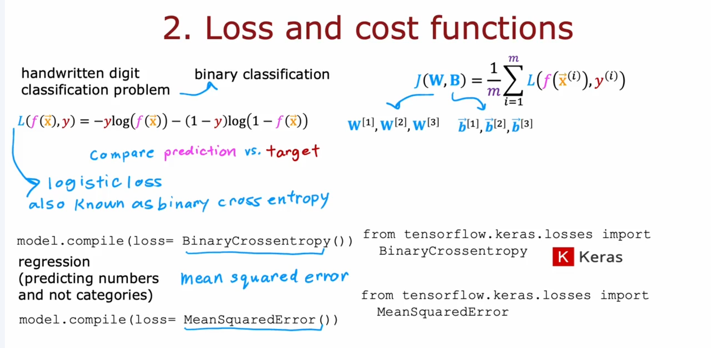

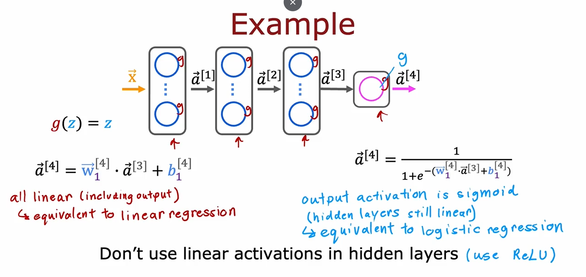

## Softmax
The softmax function is used in the output layer of neural networks for multi-class classification. It converts raw scores (logits) into probabilities, ensuring that the sum of all probabilities is 1.

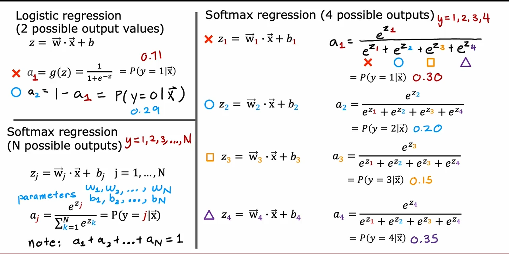

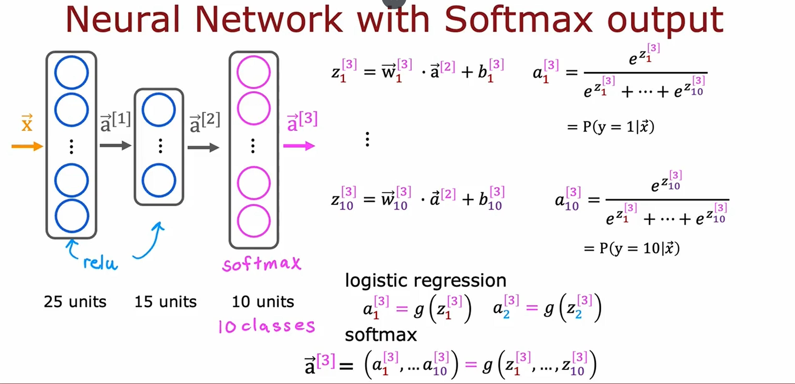

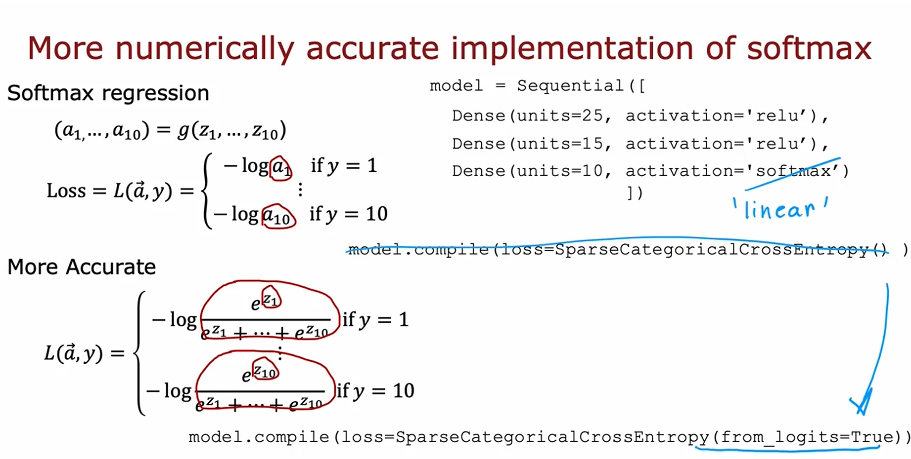

## Optimization
Optimization algorithms are used to adjust the weights and biases of a neural network to minimize the loss function. In this chapter, we use the Adam algorithm, which combines the advantages of two other extensions of stochastic gradient descent: AdaGrad and RMSProp.

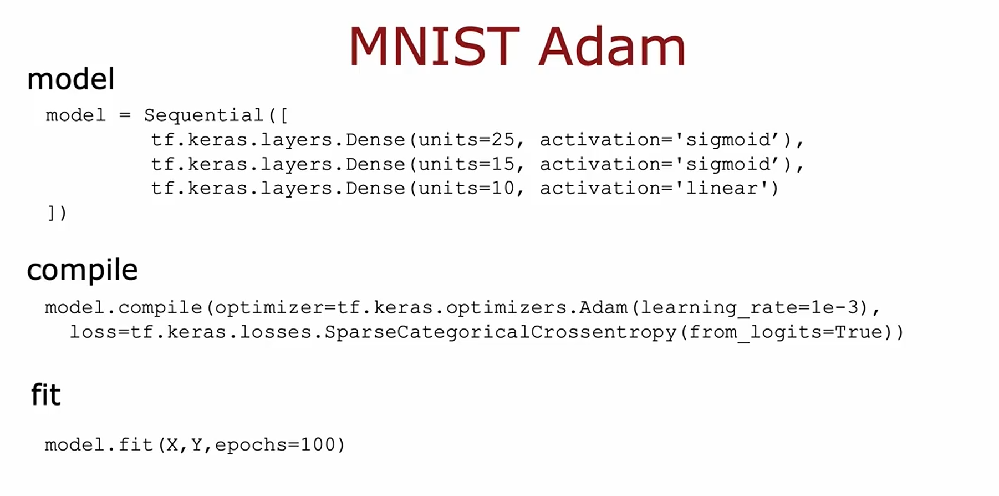

## Convolution Neural Network (CNN)
Convolutional Neural Networks are specialized neural networks for processing grid-like data, such as images. CNNs use convolutional layers to automatically and adaptively learn spatial hierarchies of features from input images.

## Select the model

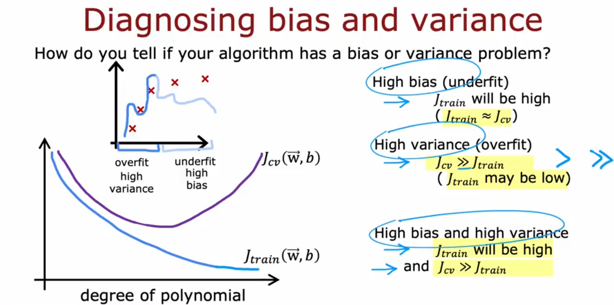