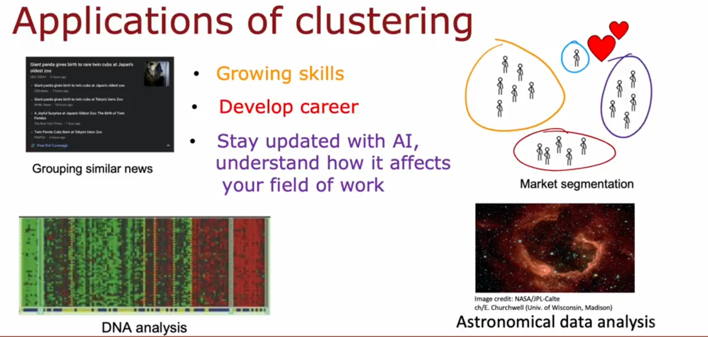
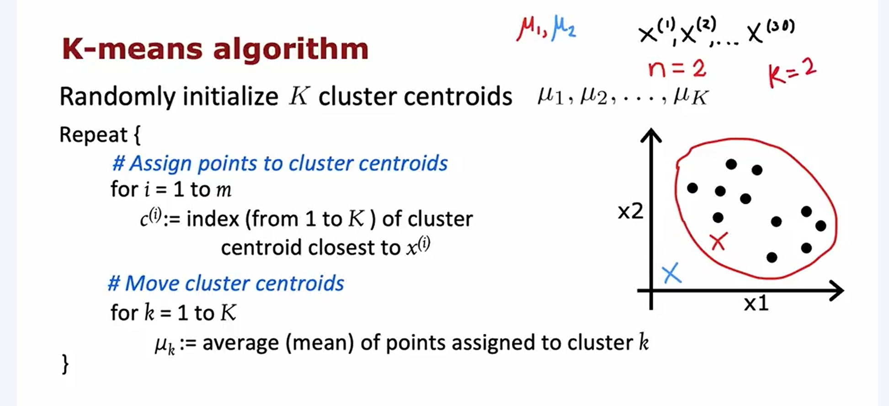
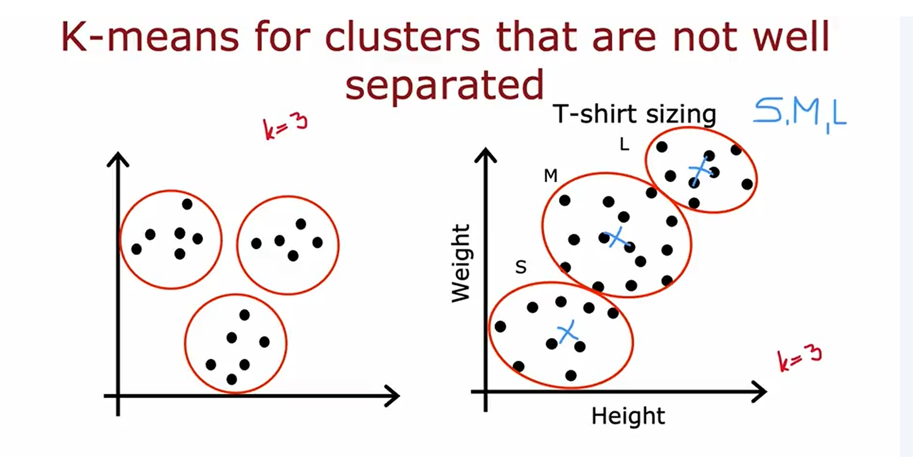
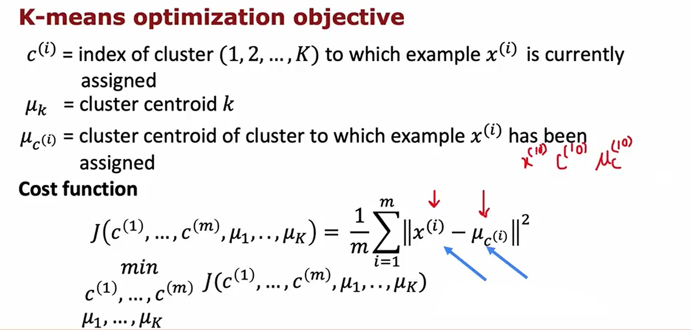
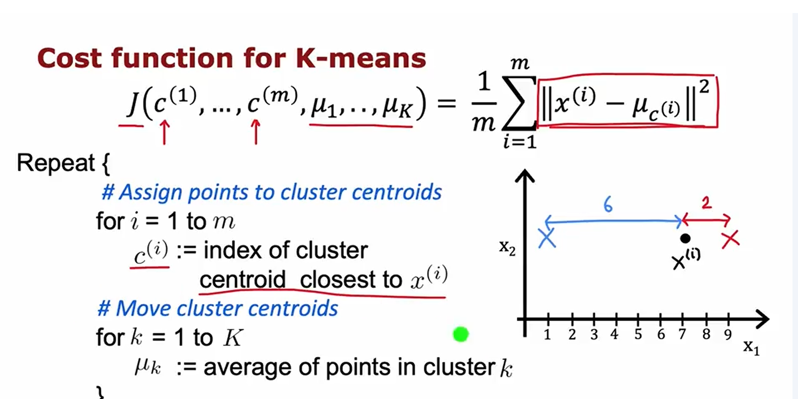
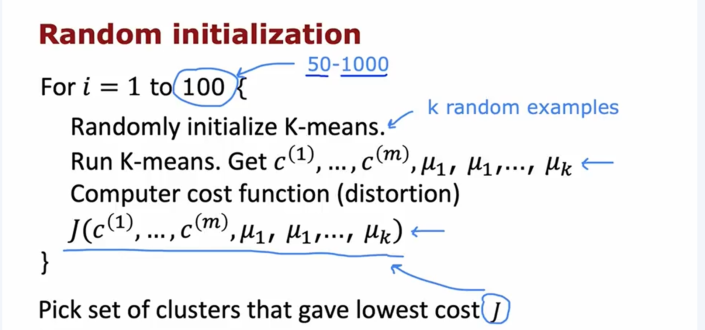
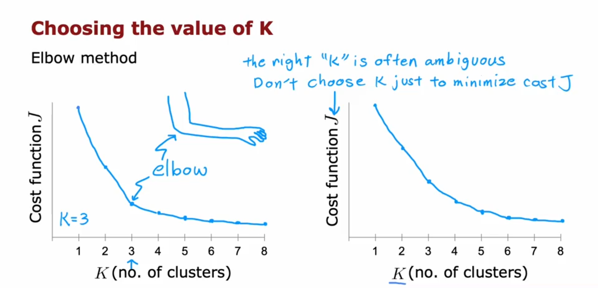

## Intro of the Clustering
![alt][image.png]

 

 ## K-means
 
 Repeat these two steps

K-means is sensitive to how the initial cluster centroids are chosen. A bad initialization can lead to local minima (poor clustering results with high distortion/cost). Instead of running K-means once, we run it many times (e.g., 100, or even 50–1000 times):

(./K-means.ipynb)

